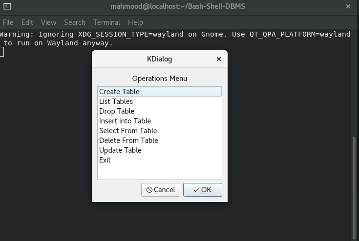
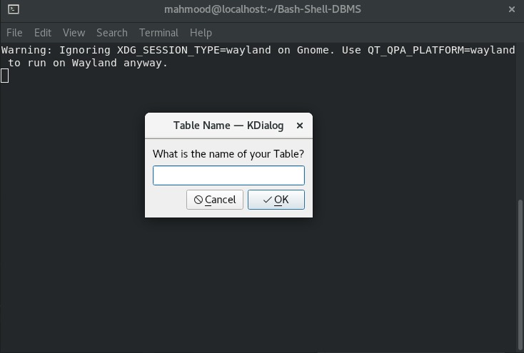
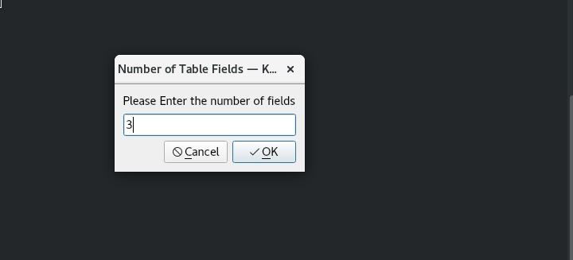
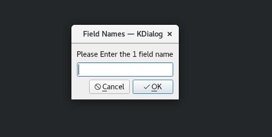
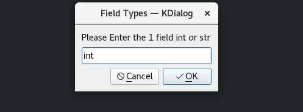
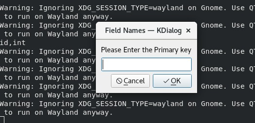
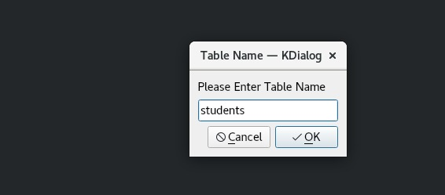
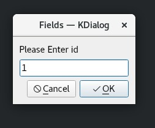
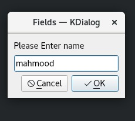

# Bash Shell DBMS 

```
 | __ )  __ _ ___| |__   |  _ \| __ )|  \/  / ___| 
 |  _ \ / _  / __| '_ \  | | | |  _ \| |\/| \___ \ 
 | |_) | (_| \__ \ | | | | |_| | |_) | |  | |___) |
 |____/ \__,_|___/_| |_| |____/|____/|_|  |_|____/ 

1) Press 1 to create database	   4) press 4 to drop database
2) press 2 to list databases	   5) press 5 to exit
3) press 3 to connect to database
Please enter a choice: 
```
## Getting Started
### Prerequisites
Before starting you will need to install kdialog for the gui app to start

if you start the scripts without having kdialog installed you will be canceled out and prompted to install kdialog

### For Ubuntu:
```
sudo apt-get kdialog
```
### For Centos:
```
sudo yum install kdialog
```
### Warning :no_entry_sign: : 
1. Please make sure the dbs folder exists in your directory.
2. if you dont have an empty folder named dbs it will not work
## Running:
for starting up you will need to start with the entry.sh Bash script file
```
./entry.sh
```
you will be propmted by a list of choices as mentioned above.

1. Enter 1 to create your first database :sunglasses: :hammer:

:no_entry_sign: Warning : you can't Enter a Database name with special characters or spaces in between, if you do enter it you will be prompted with an error message.	

now you can connect to your database through the "3" option and entering your database name
```
  ____            _       ____  ____  __  __ ____  
 | __ )  __ _ ___| |__   |  _ \| __ )|  \/  / ___| 
 |  _ \ / _  / __| '_ \  | | | |  _ \| |\/| \___ \ 
 | |_) | (_| \__ \ | | | | |_| | |_) | |  | |___) |
 |____/ \__,_|___/_| |_| |____/|____/|_|  |_|____/ 

Press 1 to create database
Press 2 to list databases
Press 3 to connect to database
Press 4 to drop database
Press 5 to exit
please enter a choice: 1
Please enter the database name: company
Database created successfully
please enter a choice: 3
Please enter the name of the database you want to connect to
Name: company
```
2. you have succefully connected to the database to perform your operations

3. operations include
* Create Table
* Update Table
* Drop Table
* Select from Table
* Drop Table
* Insert into Table
* List Tables
* Delete From Table

Now you Will be prompted with a a list of these operations to choose from


## Create Table

Lets start with Create Table ,You will be prompted to Enter your Table name.

### :no_entry_sign: Warning : you can't Enter a Table name with special charachters or spaces in between, if you do enter it you will be prompted with an error message.


Now it will ask you to enter the number of Fields in the table, it should be an integer number


After that you will be filling the name and data types of each Field

The only data types are:
 1. int  
 2. str
 
 Field Name | Field Type
------------ | -------------
| 

### Field Names Should be unique , You can't enter more than one Field with the same name

You will be asked to enter the name of the primary key field you want



### You have Successfully created your first table :partying_face: , now it's time to insert some data into the table you created.

### Lets connect to our Database again to perform some inserts


## Insert into Table

lets Enter our table name we want to insert into:


you will now start filling the fields:

 
### We have inserted into our table, lets update our table to change the name from mahmood to islam

## Update Table

upon connecting to the database and selecting the table you want to update you will see the fields you have in you table right now and will be asked to enter the primary key which is the first field

Now we enter the number of field we which want to update in our case its the second field so we enter 2 , and enter the new value islam

```
Please enter a table name: students
####################################
1,mahmood
####################################
Please Enter row's primary key that you want to update
Primary Key: 1
Please Enter a valid field number: 2
Please Enter the new value: islam
Row updated successfully

```
### Now lets check your table file you will find it updated with the new value ,lets now try to insert another field and select it with the Primary key

## Select From Table

You can select a specific record using the primary key field, meaning if the primary key is the id then you need to provide the id of the record you want to select .

```
Please enter a table name: students
Please Enter row's primary key that you want to select
Primary Key: 2
##########################
2,mahmood 
##########################

```
### We have successfully fetched the second record, now lets try to delete that record

## Delete From Table

Similar to update , if you want to delete a record you need to provide the primary key of that record to delete it from our Database

```
Please enter a table name: students
####################################
1,islam
2,mahmood
####################################
Please Enter row's primary key that you want to delete
Primary Key: 2
Row deleted Successfully

```
### Checking your file you will notice that record deleted

### You have now performed all the CRUD operations in our database :partying_face:

### Try dropping this Existing table and creating one on your own :nerd_face: